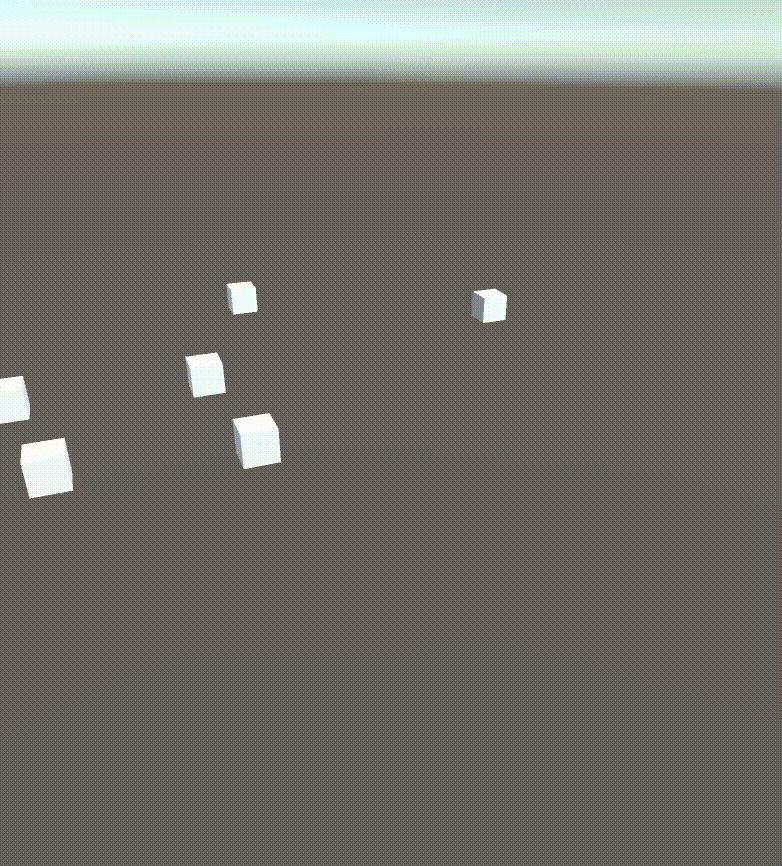

A simple free camera for Unity.\
Originally made as a debug tool.

## FreeCamera
Simply add the component somewhere in your scene. 

**Controls**\
WASD to move.\
ARROW keys and mouse movement to look around.

**Camera**\
It will automatically move `Camera.main`.\
Override this with `SetCamera`.

## FreeCameraDebug
Simply add the component somewhere in your scene. 

This automatically enables and disables the FreeCamera.

**Controls**\
F to toggle on and off (off by default).\
G to toggle mouse input (on by default).\
Left Click to enable sensitive movement.